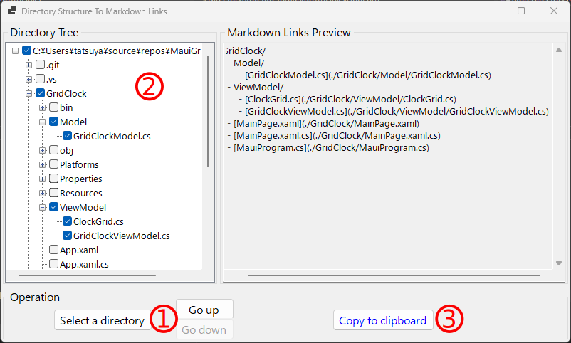

# DirectoryStructureToMarkdownLinks

A mini tool to export markdown formatted links from a directory tree.

## How to use

1. Select a directory with a Open Directory Dialog
2. Select files and directories what you want to export as markdown links
3. Copy the previewed markdown links as plain text

