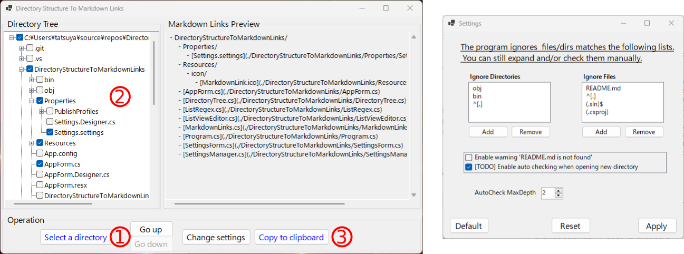
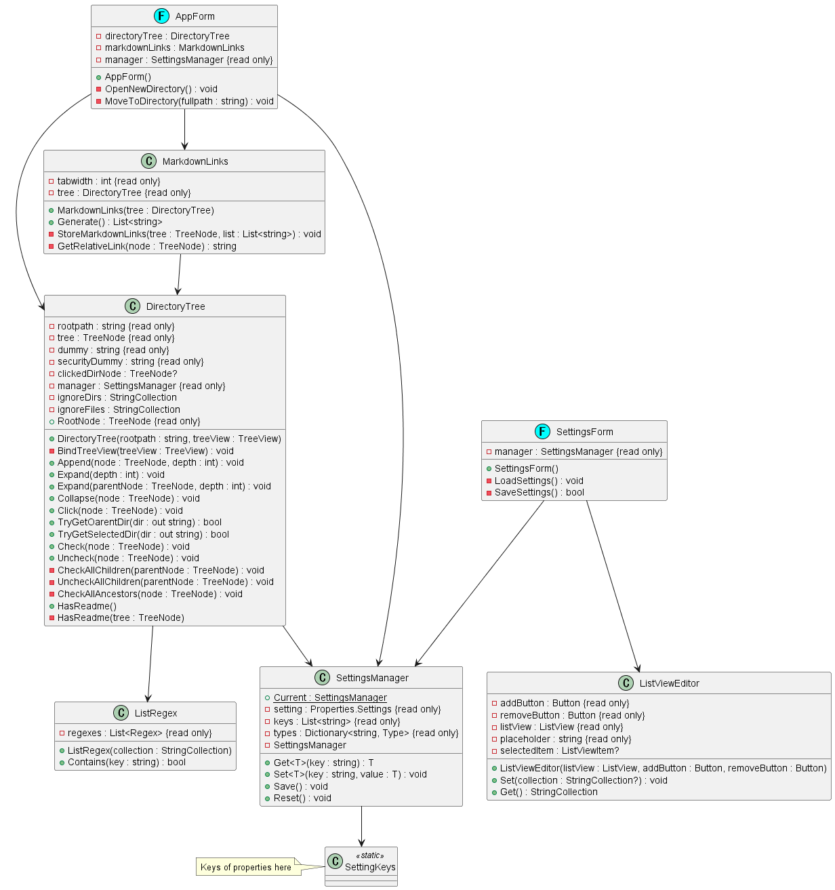

# DirectoryStructureToMarkdownLinks

A mini tool to export markdown formatted links from a directory tree.

## How to use

### Main window (Left)
1. Select a directory with a Open Directory Dialog
2. Select files and directories what you want to export as markdown links
3. Copy the previewed markdown links as plain text

### Setting window (Right)
You can add regular expressions to tell the program ignore the directories/files in the recursive operation such as tree expansion and (un)checking the boxes.

## Files edited

Details

 - DirectoryStructureToMarkdownLinks/
     - Properties/
         - [Settings.settings](./DirectoryStructureToMarkdownLinks/Properties/Settings.settings)
     - Resources/
         - icon/
             - [MarkdownLink.ico](./DirectoryStructureToMarkdownLinks/Resources/icon/MarkdownLink.ico)
     - [AppForm.cs](./DirectoryStructureToMarkdownLinks/AppForm.cs)
     - [DirectoryTree.cs](./DirectoryStructureToMarkdownLinks/DirectoryTree.cs)
     - [ListRegex.cs](./DirectoryStructureToMarkdownLinks/ListRegex.cs)
     - [ListViewEditor.cs](./DirectoryStructureToMarkdownLinks/ListViewEditor.cs)
     - [MarkdownLinks.cs](./DirectoryStructureToMarkdownLinks/MarkdownLinks.cs)
     - [Program.cs](./DirectoryStructureToMarkdownLinks/Program.cs)
     - [SettingsForm.cs](./DirectoryStructureToMarkdownLinks/SettingsForm.cs)
     - [SettingsManager.cs](./DirectoryStructureToMarkdownLinks/SettingsManager.cs)

## UML(partial)

Class diagram

